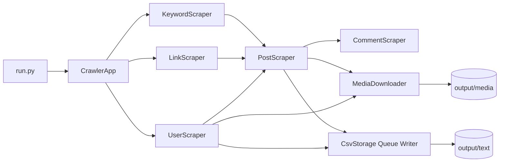

# WeiboCrawler 使用文档

支持关键词、帖子链接、批量用户目标三种抓取入口，覆盖帖子、评论、媒体和主页数据，支持增量去重与队列化落盘。


## 项目简介

`WeiboCrawler` 的目标不是“跑一次就扔”的脚本，而是一个可持续运行、可复核、可交接的数据采集工程。

适用场景：
- 品牌与竞品舆情监测
- 热点事件与关键词专题跟踪
- KOL/KOC 账号画像研究
- 图片/视频媒体素材归档

## 主要功能

| 能力 | 说明 |
|---|---|
| 多模式入口 | `keyword` / `post_url` / `user` 可组合运行 |
| 评论分层抓取 | 一级评论 + 楼中楼独立开关 |
| 媒体模式 | 支持图片/视频类型过滤与本地下载 |
| 主页信息抓取 | 粉丝、关注、简介、认证、头像、封面等 |
| 数据可靠落盘 | 边抓边写 + writer 协程批量刷盘 |
| 增量去重 | 启动加载历史索引，避免重复写入 |
| 输出结构标准化 | `output/text` 与 `output/media` 分离，按模式分目录 |
| 数据格式可选 | `csv` / `json` / `both` |

## 系统架构



## 模式能力矩阵

| 模式 | 输入目标 | 抓帖子 | 抓评论 | 抓媒体 | 抓主页信息 |
|---|---|---|---|---|---|
| `keyword` | `TARGET_KEYWORDS` | ✅ | ✅（可开关） | ✅（可开关） | ❌ |
| `post_url` | `TARGET_POST_URLS`（仅帖子链接） | ✅ | ✅（可开关） | ✅（可开关） | ❌ |
| `user` | `TARGET_USER_TARGETS`（uid/主页链接/用户名） | ✅ | ✅（可开关） | ✅（可开关） | ✅（可开关） |

## 快速开始

### 1) 安装依赖

```bash
python3 -m pip install -r requirements.txt
python3 -m playwright install chromium
```

### 2) 配置抓取项

编辑：`weibo_crawler/user_config.py`

### 3) 启动运行

```bash
python3 run.py
```

首次运行会弹浏览器扫码登录，登录态缓存到 `.weibo_auth/`。

## 配置说明

### 抓取模式

```python
SELECTED_MODES = ["keyword", "post_url", "user"]
```

别名兼容：
- `url` / `link` / `comment` -> `post_url`
- `personal` -> `user`

### 模式目标路由（严格映射）

```python
TARGET_KEYWORDS = ["Apple", "华为"]
TARGET_POST_URLS = ["https://weibo.com/xxxx/xxxx"]  # 这里仅放帖子链接
TARGET_USER_TARGETS = [
    "7040797671",
    "https://weibo.com/u/7040797671",
    "https://weibo.com/n/用户名",
    "@用户名",
]
```

### 保存格式

```python
SAVE_FORMAT = "csv"   # csv / json / both
```

### 媒体开关

```python
ENABLE_MEDIA_MODE = True
MEDIA_TYPE_MODE = "all"          # all / image / video
ENABLE_MEDIA_DOWNLOAD = True
OVERWRITE_EXISTING_MEDIA = False
ENABLE_PROFILE_MEDIA = True
```

### 评论开关

```python
ENABLE_COMMENTS_FOR_KEYWORD = True
ENABLE_COMMENTS_FOR_POST_URL = True
ENABLE_COMMENTS_FOR_USER = True
FETCH_TOP_LEVEL_COMMENTS = True
FETCH_SUB_COMMENTS = True
```

### 数量控制（0=不限）

```python
MAX_POSTS_PER_SEARCH_PAGE = 20
MAX_POSTS_PER_KEYWORD = 4
MAX_COMMENTS_PER_KEYWORD = 100
MAX_COMMENTS_PER_POST = 100
MAX_USER_PAGES = 2
MAX_POSTS_PER_USER = 20
```

## 数据输出

```text
output/
  text/
    keyword/
      comments.csv / posts.csv / media.csv
      comments.jsonl / posts.jsonl / media.jsonl
    post_url/
      comments.csv / posts.csv / media.csv
      comments.jsonl / posts.jsonl / media.jsonl
    user/
      comments.csv / posts.csv / media.csv / profiles.csv
      comments.jsonl / posts.jsonl / media.jsonl / profiles.jsonl
  media/
    keyword/<author>/<post_id>/...
    post_url/<author>/<post_id>/...
    user/<author>/<post_id>/...
```

### 关键字段
- `posts.*`：`是否带V`、`转发量`、`评论量`、`点赞量`
- `comments.*`：`评论IP属地`、`评论层级`
- `profiles.*`：粉丝、关注、认证、头像、封面、互动指标
- `media.*`：媒体类型、媒体链接、本地文件路径、下载状态

## 运行步骤建议

1. 冒烟：先开单模式 + 小限额（1-3 条帖子）验证字段和目录。
2. 小批量：确认评论 IP 非空率、媒体落地率、失败日志。
3. 全量：按 `keyword -> post_url -> user` 分批跑，避免一次超载。
4. 复核：核验 `output/text/*/*.csv` 行数、字段、去重效果。

## 常见问题

### 1) 为什么只有视频没有图片？
检查 `MEDIA_TYPE_MODE` 是否被设置为 `video`，或目标帖子确实无图片。

### 2) 为什么评论 `IP属地` 有空值？
部分历史评论或接口返回本身不含该字段，属于源数据限制。

### 3) 为什么配置了目标却没抓到？
优先检查：模式是否开启、目标是否放在对应列表、评论/媒体开关是否开启。

### 4) `post_url` 与 `user` 区别是什么？
- `post_url`：以帖子为中心抓单帖链路。
- `user`：以用户为中心抓主页 + 主页帖子链路。

## 合规建议

- 严格遵守法律法规与平台条款
- 控制抓取频率和并发，避免异常访问
- 对数据做权限控制与必要脱敏
- 保留任务审计记录（操作者、目标、时间、输出）

## 后续计划

- [x] 多模式抓取（keyword/post_url/user）
- [x] 评论分层抓取与限额控制
- [x] 媒体下载与路径回填
- [x] 按模式分目录输出 + 队列化写盘
- [ ] 外部调度编排（Cron/Airflow）
- [ ] 失败重试告警（Webhook/飞书/钉钉）
- [ ] 容器化与监控看板

## 贡献指南

欢迎提交 Issue / PR。建议优先贡献：
- 反爬稳定性优化
- 数据质量校验工具
- 调度、告警、指标可观测增强

## 免责声明

### 1. 项目目的
本项目仅用于学习和研究网络数据采集技术。

### 2. 合规责任
使用者需自行确保行为合法合规，违反法律法规或平台协议造成的后果由使用者自行承担。

### 3. 禁止事项
禁止将本项目用于任何非法用途、商业侵权或大规模恶意抓取行为。

### 4. 责任限制
开发者不对因使用本项目造成的任何直接或间接损失承担责任。
